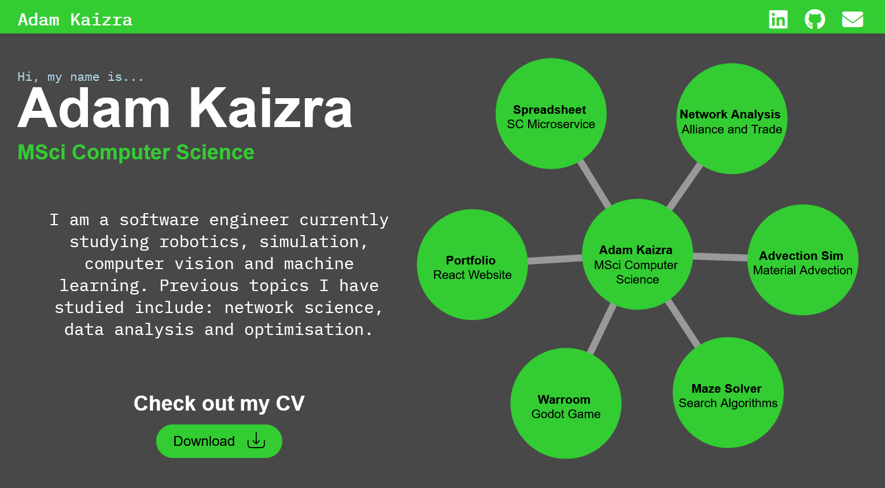

# Software Engineer Portfolio

 

> Development has ended

### Available at https://kaizra.dev

A website to present a selection of my programming projects and give an overview of who I am in a more enganging way than my CV and Github repos.
This project is made in React with JavaScript, Html and CSS.

The site is split into 5 sections:
- About me
- Interactable graph with outer nodes being projects
- Dissertation summary with an network visualisation example
- Technology Icons
- Footer

### Components

React allows the creation of separate components which can be found in their respective folders in `src/components/example`.
If you're interested in how I made any parts of the website, you can check out each component here.

The project graph was made with D3.js by setting up a dummy graph. I used the dragging attributes of D3 and some CSS to dynamically change the cursor and created an
external link svg to communicate better that clicking takes you to the github repo. The size of the graph is scaled down for mobile.

The network graph in my dissertation section is able to be zoomed and panned by clicking using the react-image-zoom npm package. It works well on desktop however if you
accidently touch it on mobile when scrolling it can be frustrating so I may remove it from the mobile site.

The technologies section uses icons from simple-icons and some css to set an effect when hovering or clicking on mobile. The text that appears are just tooltips stylised with css.
I use the CSS `display: grid;` option to change the icons from a single row in desktop to 3 rows in mobile.

### Deployment

The website is front-end only and is deployed with the react github pages package. The github page is crn91.github.io/Portfolio but I am using a custom domain so all traffic is forwarded to kaizra.dev .
This can be changed in the `CNAME` and `package.json` files by replacing kaizra.dev with a different domain.

The site can be ran with npm's development local host by cloning the repository and installing npm dependencies found in package.json if not already done.

## License

[MIT](https://choosealicense.com/licenses/mit/)
